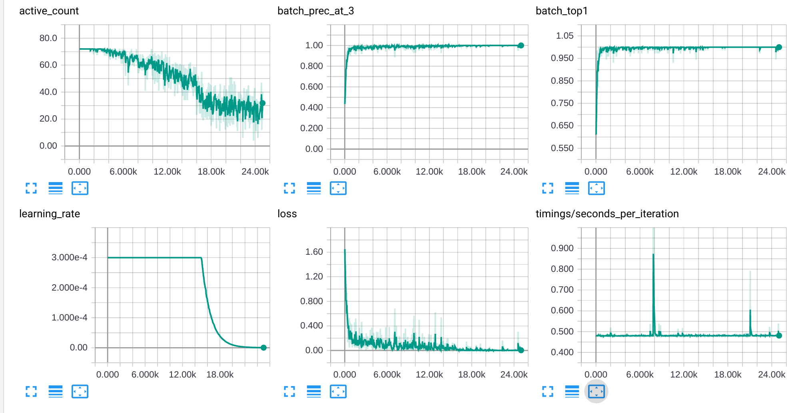

# Triplet-based Person Re-Identification

Code for reproducing the results of our [In Defense of the Triplet Loss for Person Re-Identification](https://arxiv.org/abs/1703.07737) paper.

We provide the following things:
- The exact pre-trained weights for the TriNet model as used in the paper, including some rudimentary example code for using it to compute embeddings.
  See section [Pretrained models](#pretrained-models).
- A clean re-implementation of the training code that can be used for training your own models/data.
  See section [Training your own models](#training-your-own-models).
- A script for evaluation which computes the CMC and mAP of embeddings in an HDF5 ("new .mat") file.
  See section [Evaluating embeddings](#evaluating-embeddings).
- A list of [independent re-implementations](#independent-re-implementations).

If you use any of the provided code, please cite:
```
@article{HermansBeyer2017Arxiv,
  title       = {{In Defense of the Triplet Loss for Person Re-Identification}},
  author      = {Hermans*, Alexander and Beyer*, Lucas and Leibe, Bastian},
  journal     = {arXiv preprint arXiv:1703.07737},
  year        = {2017}
}
```


# Pretrained TensorFlow models

For convenience, we provide the pretrained weights for our TriNet TensorFlow model, trained on Market-1501 using the code from this repository and the settings form our paper. The TensorFlow checkpoint can be downloaded in the [release section](https://github.com/VisualComputingInstitute/triplet-reid/releases/tag/250eb1).


# Pretrained Theano models

We provide the exact TriNet model used in the paper, which was implemented in
[Theano](http://deeplearning.net/software/theano/install.html)
and
[Lasagne](http://lasagne.readthedocs.io/en/latest/user/installation.html).

As a first step, download either of these pre-trained models:
- [TriNet trained on MARS](https://omnomnom.vision.rwth-aachen.de/data/trinet-mars.npz) (md5sum: `72fafa2ee9aa3765f038d06e8dd8ef4b`)
- [TriNet trained on Market1501](https://omnomnom.vision.rwth-aachen.de/data/trinet-market1501.npz) (md5sum: `5353f95d1489536129ec14638aded3c7`)

Next, create a file (`files.txt`) which contains the full path to the image files you want to embed, one filename per line, like so:

```
/path/to/file1.png
/path/to/file2.jpg
```

Finally, run the `trinet_embed.py` script, passing both the above file and the pretrained model file you want to use, like so:

```
python trinet_embed.py files.txt /path/to/trinet-mars.npz
```

And it will output one comma-separated line for each file, containing the filename followed by the embedding, like so:

```
/path/to/file1.png,-1.234,5.678,...
/path/to/file2.jpg,9.876,-1.234,...
```

You could for example redirect it to a file for further processing:

```
python trinet_embed.py files.txt /path/to/trinet-market1501.npz >embeddings.csv
```

You can now do meaningful work by comparing these embeddings using the Euclidean distance, for example, try some K-means clustering!

A couple notes:
- The script depends on [Theano](http://deeplearning.net/software/theano/install.html), [Lasagne](http://lasagne.readthedocs.io/en/latest/user/installation.html) and [OpenCV Python](http://opencv.org/) (`pip install opencv-python`) being correctly installed.
- The input files should be crops of a full person standing upright, and they will be resized to `288x144` before being passed to the network.


# Training your own models

If you want more flexibility, we now provide code for training your own models.
This is not the code that was used in the paper (which became a unusable mess),
but rather a clean re-implementation of it in [TensorFlow](https://www.tensorflow.org/),
achieving about the same performance.

- **This repository requires at least version 1.4 of TensorFlow.**
- **The TensorFlow code is Python 3 only and won't work in Python 2!**

:boom: :fire: :exclamation: **If you train on a very different dataset, don't forget to tune the learning-rate and schedule** :exclamation: :fire: :boom:

If the dataset is much larger, or much smaller, you might need to train much longer or much shorter.
Market1501, MARS (in tracklets) and DukeMTMC are all roughly similar in size, hence the same schedule works well for all.
CARS196, for example, is much smaller and thus needs a much shorter schedule.

## Defining a dataset

A dataset consists of two things:

1. An `image_root` folder which contains all images, possibly in sub-folders.
2. A dataset `.csv` file describing the dataset.

To create a dataset, you simply create a new `.csv` file for it of the following form:

```
identity,relative_path/to/image.jpg
```

Where the `identity` is also often called `PID` (`P`erson `ID`entity) and corresponds to the "class name",
it can be any arbitrary string, but should be the same for images belonging to the same identity.

The `relative_path/to/image.jpg` is relative to aforementioned `image_root`.

## Training

Given the dataset file, and the `image_root`, you can already train a model.
The minimal way of training a model is to just call `train.py` in the following way:

```
python train.py \
    --train_set data/market1501_train.csv \
    --image_root /absolute/image/root \
    --experiment_root ~/experiments/my_experiment
```

This will start training with all default parameters.
We recommend writing a script file similar to `market1501_train.sh` where you define all kinds of parameters,
it is **highly recommended** you tune hyperparameters such as `net_input_{height,width}`, `learning_rate`,
`decay_start_iteration`, and many more.
See the top of `train.py` for a list of all parameters.

As a convenience, we store all the parameters that were used for a run in `experiment_root/args.json`.

### Pre-trained initialization

If you want to initialize the model using pre-trained weights, such as done for TriNet,
you need to specify the location of the checkpoint file through `--initial_checkpoint`.

For most common models, you can download the [checkpoints provided by Google here](https://github.com/tensorflow/models/tree/master/research/slim#pre-trained-models).
For example, that's where we get our ResNet50 pre-trained weights from,
and what you should pass as second parameter to `market1501_train.sh`.

### Example training log

This is what a healthy training on Market1501 looks like, using the provided script:



The `Histograms` tab in tensorboard also shows some interesting logs.

## Interrupting and resuming training

Since training can take quite a while, interrupting and resuming training is important.
You can interrupt training at any time by hitting `Ctrl+C` or sending `SIGINT (2)` or `SIGTERM (15)`
to the training process; it will finish the current batch, store the model and optimizer state,
and then terminate cleanly.
Because of the `args.json` file, you can later resume that run simply by running:

```
python train.py --experiment_root ~/experiments/my_experiment --resume
```

The last checkpoint is determined automatically by TensorFlow using the contents of the `checkpoint` file.

## Performance issues

For some reason, current TensorFlow is known to have inconsistent performance and can sometimes become very slow.
The current only known workaround is to install google's performance-tools and preload tcmalloc:

```
env LD_PRELOAD=/usr/lib/libtcmalloc_minimal.so.4 python train.py ...
```

This fixes the issues for us most of the time, but not always.
If you know more, please open an issue and let us know!

## Out of memory

The setup as described in the paper requires a high-end GPU with a lot of memory.
If you don't have that, you can still train a model, but you should either use a smaller network,
or adjust the batch-size, which itself also adjusts learning difficulty, which might change results.

The two arguments for playing with the batch-size are `--batch_p` which controls the number of distinct
persons in a batch, and `--batch_k` which controls the number of pictures per person.
We usually lower `batch_p` first.

## Custom network architecture

TODO: Documentation. It's also pretty straightforward.

### The core network

### The network head

## Computing embeddings

Given a trained net, one often wants to compute the embeddings of a set of pictures for further processing.
This can be done with the `embed.py` script, which can also serve as inspiration for using a trained model in a larger program.

The following invocation computes the embeddings of the Market1501 query set using some network:

```
python embed.py \
    --experiment_root ~/experiments/my_experiment \
    --dataset data/market1501_query.csv \
    --filename market1501_query_embeddings.h5
```

The embeddings will be written into the HDF5 file at `~/experiments/my_experiment/test_embeddings.h5` as dataset `embs`.
Most relevant settings are automatically loaded from the experiment's `args.json` file, but some can be overruled on the commandline.

If the training was performed using data augmentation (highly recommended),
one can invest a some more time in the embedding step in order to compute augmented embeddings,
which are usually more robust and perform better in downstream tasks.

The following is an example that computes extensively augmented embeddings:

```
python embed.py \
    --experiment_root ~/experiments/my_experiment \
    --dataset data/market1501_query.csv \
    --filename market1501_query_embeddings_augmented.h5 \
    --flip_augment \
    --crop_augment five \
    --aggregator mean
```

This will take 10 times longer, because we perform a total of 10 augmentations per image (2 flips times 5 crops).
All individual embeddings will also be stored in the `.h5` file, thus the disk-space also increases.
One question is how the embeddings of the various augmentations should be combined.
When training using the euclidean metric in the loss, simply taking the mean is what makes most sense,
and also what the above invocation does through `--aggregator mean`.
But if one for example trains a normalized embedding (by using a `_normalize` head for instance),
The embeddings *must* be re-normalized after averaging, and so one should use `--aggregator normalized_mean`.
The final combined embedding is again stored as `embs` in the `.h5` file, as usual.

# Evaluating embeddings

Once the embeddings have been generated, it is a good idea to compute CMC curves and mAP for evaluation.
With only minor modifications, the embedding `.h5` files can be used in
[the official Market1501 MATLAB evaluation code](https://github.com/zhunzhong07/IDE-baseline-Market-1501),
which is exactly what we did for the paper.

For convenience, and to spite MATLAB, we also implemented our own evaluation code in Python.
This code additionally depends on [scikit-learn](http://scikit-learn.org/stable/),
and still uses TensorFlow only for re-using the same metric implementation as the training code, for consistency.
We verified that it produces the exact same results as the reference implementation.

The following is an example of evaluating a Market1501 model, notice it takes a lot of parameters :smile::

```
./evaluate.py \
    --excluder market1501 \
    --query_dataset data/market1501_query.csv \
    --query_embeddings ~/experiments/my_experiment/market1501_query_embeddings.h5 \
    --gallery_dataset data/market1501_test.csv \
    --gallery_embeddings ~/experiments/my_experiment/market1501_test_embeddings.h5 \
    --metric euclidean \
    --filename ~/experiments/my_experiment/market1501_evaluation.json
```

The only thing that really needs explaining here is the `excluder`.
For some datasets, especially multi-camera ones,
one often excludes pictures of the query person from the gallery (for that one person)
if it is taken from the same camera.
This way, one gets more of a feeling for across-camera performance.
Additionally, the Market1501 dataset contains some "junk" images in the gallery which should be ignored too.
All this is taken care of by `excluders`.
We provide one for the Market1501 dataset, and a `diagonal` one, which should be used where there is no such restriction,
for example the Stanford Online Products dataset.

# :exclamation: Important evaluation NOTE :exclamation:

The implementation of `mAP` computation has [changed from sklearn v0.18 to v0.19](http://scikit-learn.org/stable/whats_new.html#version-0-19).
The implementation in v0.18 and earlier is exactly the same as in the official Market1501 MATLAB evaluation code, but is [wrong](https://github.com/scikit-learn/scikit-learn/pull/7356).
The implementation in v0.19 and later leads to a roughly one percentage point increase in `mAP` score.
It is not correct to compare values across versions, and again, all values in our paper were computed by the official Market1501 MATLAB code.
The evaluation code in this repository simply uses the scikit-learn code, and thus **the score depends on which version of scikit-learn you are using**.
Unfortunately, almost no paper mentions which code-base they used and how they computed `mAP` scores, so comparison is difficult.
Other frameworks have [the same problem](https://github.com/Cysu/open-reid/issues/50), but we expect many not to be aware of this.

# Independent re-implementations

These are the independent re-implementations of our paper that we are aware of,
please send a pull-request to add more:

- [Open-ReID](https://github.com/Cysu/open-reid) (PyTorch, MIT license)
- https://github.com/huanghoujing/person-reid-triplet-loss-baseline (PyTorch, no license)

Not technically independent re-implementation, but open-sourced works which use this code in some way that we are aware of, and again pull-requests to add more are welcome:

- https://github.com/VisualComputingInstitute/towards-reid-tracking is our own work exploring the integration of ReID and tracking (Code for the paper [Towards a Principled Integration of Multi-Camera Re-Identification and Tracking through Optimal Bayes Filters](https://arxiv.org/abs/1705.04608))
- https://github.com/cftang0827/human_recognition is a simple wrapper, combining this with an OpenCV detector. See also [#47](https://github.com/VisualComputingInstitute/triplet-reid/issues/47)
